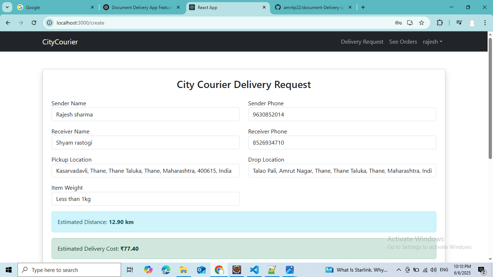
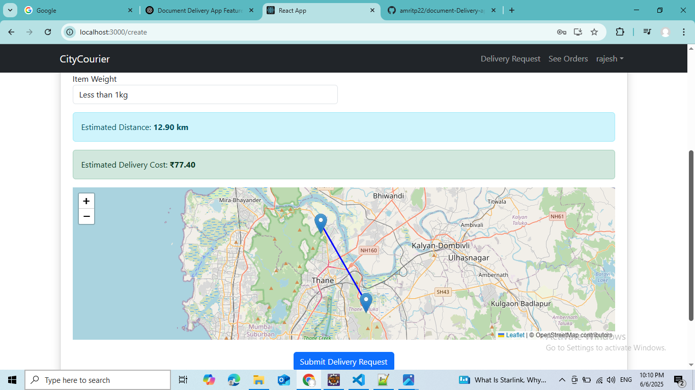

# 🚀 Document / Personal Item Delivery Web Application

A full-stack web application for **city-wide document & item delivery** — built using:

- 🏗️ Backend → **Spring Boot** + **MySQL** + **Spring Security** + **WebSocket**
- 🎨 Frontend → **React.js** + **React Router** + **React Toastify**
- 🌍 Real-time features → WebSocket-based Live Tracking + Notifications

---

## ✨ Features

### 👤 User & Agent Login

- Role-based login flow — users and agents login using JWT-based authentication.
- Role is passed from backend → frontend (`USER` or `AGENT`).

### 📦 Delivery Request Creation (User)

- Users can create delivery requests by entering:
  - Pickup location
  - Drop location
  - Item weight
  - Sender/Receiver details
- Users see **calculated distance** & **estimated cost** before confirming the request.

### 📊 Distance & Cost Calculation

- Uses **Haversine formula** to compute the distance.
- Cost is dynamically calculated based on the distance and item weight.

### 🚀 Live Order Tracking (User)

- Once the agent marks status to **"On The Way"**, users can:
  - View agent’s **live moving marker** on the map.
  - See the path between agent and destination (Polyline).
  - **Live Tracking** is powered by **WebSocket** (`/topic/location/{agentId}`).

### 📝 My Orders (User)

- Users can view all their delivery requests.
- For each request, they can see:
  - Current status (`PENDING`, `ASSIGNED`, `ON_THE_WAY`, `DELIVERED`).
  - Assigned agent (name).

### ⚡ Agent Self-Assignment (Agent)

- Agents see a list of **pending delivery requests**.
- Agent can accept (assign to self) any request.
- Assignment is handled via secured API.

### 🚦 Status Management (Agent)

- Once assigned, agents can update the delivery status:
  - `ON_THE_WAY`
  - `PICKED_UP`
  - `DELIVERED`

### 🔔 Notifications System (Real-Time, WebSocket-Based)

- **All Agents** receive a **real-time WebSocket notification** when a new delivery request is created.
- **User** receives a **real-time notification** when:
  - Agent accepts their request.
  - Agent updates delivery status.

- Notifications are shown via **React Toastify** with sound feedback.

---

## 📸 Screenshots

### 🏠 Home Page


### 📝 Create Delivery Request


### 📊 Distance & Cost Calculation UI


### 📋 User's My Orders


### 📍 Live Tracking Screen


### 📋 Pending Orders (Agent)


### 🚦 Agent Status Update Screen


### 🔔 Notification Popup (Agent)


### 🔔 Notification Popup (User)


## 🛠️ Architecture

```plaintext
Frontend (React) <-> Backend (Spring Boot REST API + WebSocket) <-> Database (MySQL)
